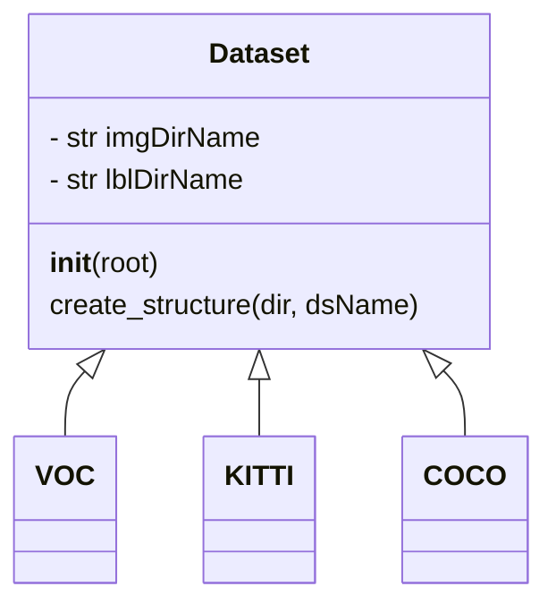

# DSCollection

```mermaid
classDiagram
    Dataset <|-- VOC
    Dataset <|-- KITTI
    Dataset <|-- COCO
    Dataset : - str imgDirName
    Dataset : - str lblDirName
    Dataset : __init__(root)
    Dataset : create_structure(dir, dsName)
    

```